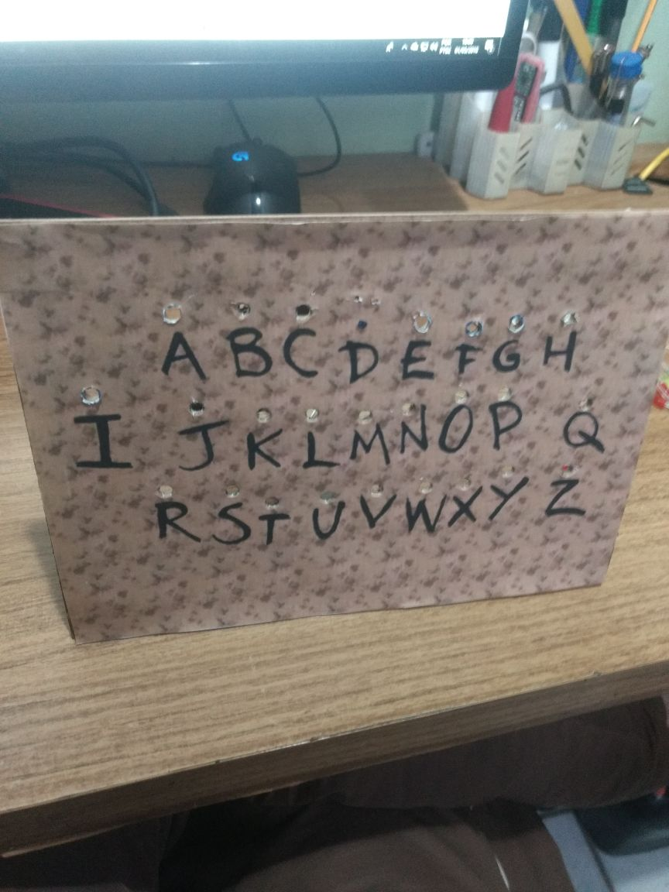
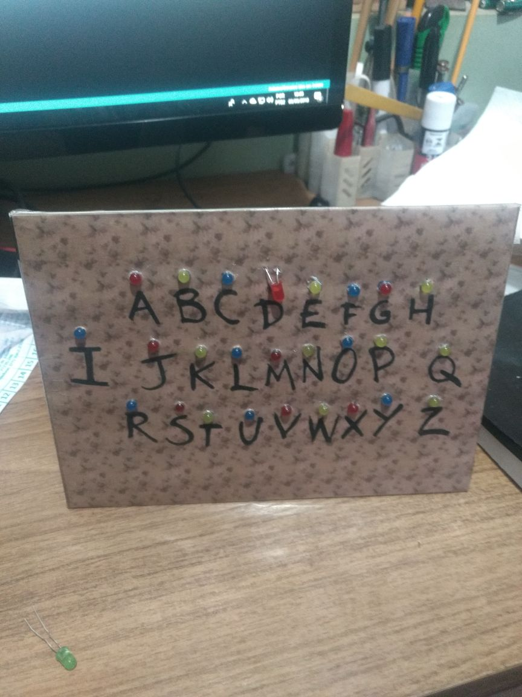
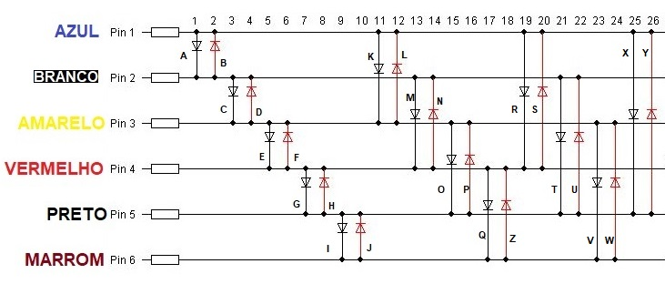
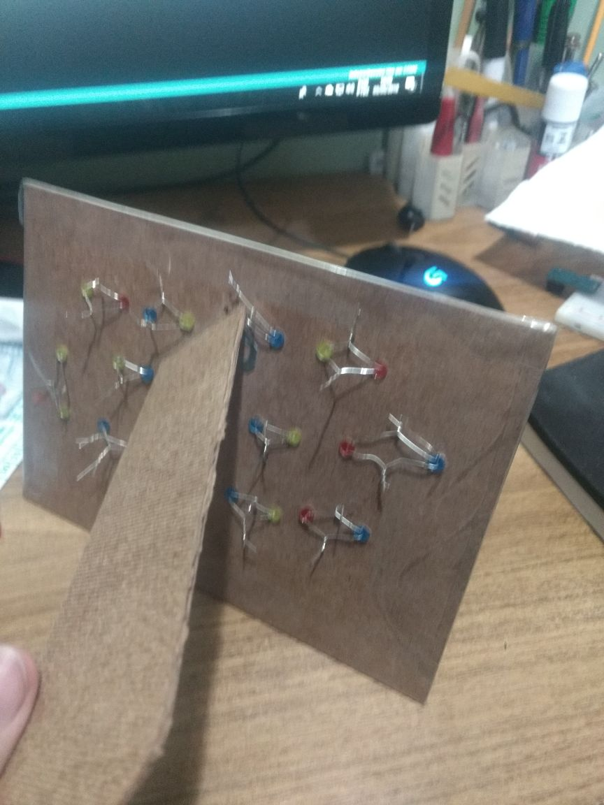
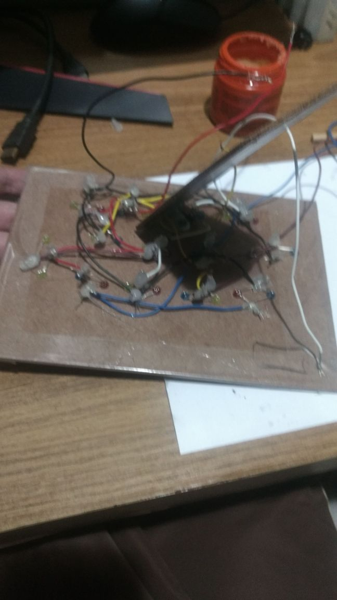
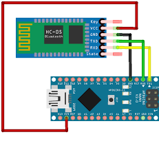

# Stranger things Board

## About

That stranger things is a great series, no one has doubts. But for me it have a special meaning, because me and my girlfriend watched it together and nothing more cool that make a thematic gift to give to her at Valentine's Day

## Introduction

This project consists of a frame with leds powered by an Arduino Nano with an HC-05 Bluetooth module, controlled by an Android App that sends a word to the board. The board displays the received word blinking the led related to each letter of this word, like the scene where Will talk to his mother form upside down .

## Bill of materials
//todo

## The pins' limitation problem

The Arduino Nano board have 13 pins to use as digital IO. Bluetooth module
use the 2 pins, remaining 11 pins to blink the leds but alphabet have 26 letters...

### Charlieplexing

To solve this I found a solution: charlieplexing. Charlieplexing is a technique to drive lots of leds with few pins, following the relation Nl = Np * (Np-1), where Nl is the number of leds you can controll and Np the number of pins you use. In this case with just 6 pins I can controll 30 leds. You can read more about it [here](http://www.instructables.com/id/Charlieplexing-LEDs--The-theory/).

## Assemble Instructions
### Arduino  photo board

To assemble the Arduino frame follow this steps:

1. Buy a photo frame. I choose one with 25 cm X 15 cm
2. Print this [file](media/resources/photo-frame-background.png) in a good quality, with the same size of the photo frame
3. Glue the printed image in the photo frame and drill in top of each letter, using a dremel or other tool you prefer. Next, Put the leds in the holes you made in previous step


 

4. wire the leds as the folowing schematic. To make the wire more easy, I use different wire colors, and using the same color name in the arduino code.




 


5. Plug the wires in Arduino port of your choise, or use the same defined in code. Don't use the pins 0 and 1, these are needed to connect to HC-05

```C
#define BLUE_PIN 2
#define WHITE_PIN 4
#define YELLOW_PIN 6
#define RED_PIN 8
#define BLACK_PIN 10
#define BROWN_PIN 12
```

6. Wire the hc-05 module to Arduino nano




7. (Optional) Change the Bluetooth name using AT commands (read more [here](http://www.instructables.com/id/Modify-The-HC-05-Bluetooth-Module-Defaults-Using-A/))

### Android app

Assemble android app is simple.

1. In your Android phone, open Bluetooth settings and pair with your hc-05 Bluetooth
2. Open the android project with Android Studio
3. Open the class com.apps.esampaio.strangerthingsboard.Constants, and set the HC-05 name

```Kotlin
object Constants {

val BLUETOOTH_MODULE_NAME = "CHANGE HERE"

```
4. Deploy the app to your phone and enjoy